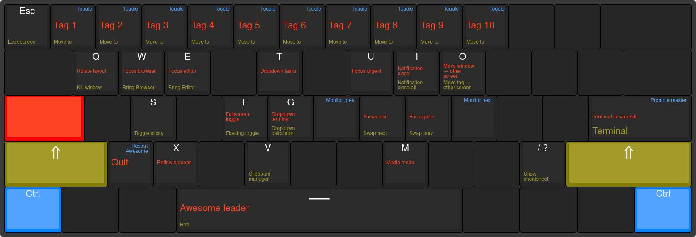

This directory will try to document my different keybindings.

## Base layout

I use an Anne Pro 60% keyboard that looks like this (with my custom layout set):

## Super keybinds

When holding Super ("Windows key", "Logo key", etc.), the following shortcuts
become available:

| Color   | Modifiers                                         |
|---------|---------------------------------------------------|
| Red     | <kbd>Super</kbd>                                  |
| Yellow  | <kbd>Super</kbd> <kbd>Shift</kbd>                 |
| Blue    | <kbd>Super</kbd> <kbd>Ctrl</kbd>                  |

This cheatsheet can be shown on the current screen with
<kbd>Super</kbd> <kbd>?</kbd>.

## Chords

I'm heavily using "chords", which is a series of keypresses. A chord could, for
example, be <kbd>a</kbd> <kbd>b</kbd> <kbd>c</kbd> - e.g. "Press and release a,
then press and release b, then press and release c".

This is similar to Doom Emacs, Spacemacs, Spacevim, etc. do bindings with their
"leader" keys.

My WM pops up a dialog showing the available keys while you are inside a chord,
making it possible to place a large number of bindings under a small surface
and without me having to remember a lot of them. Over time the ones I use the
most will become quick muscle memory, but the ones I seldom use can still be
found with no major issues.

You can look at the chords in Awesome WM in `config/awesome/keys.lua`.
