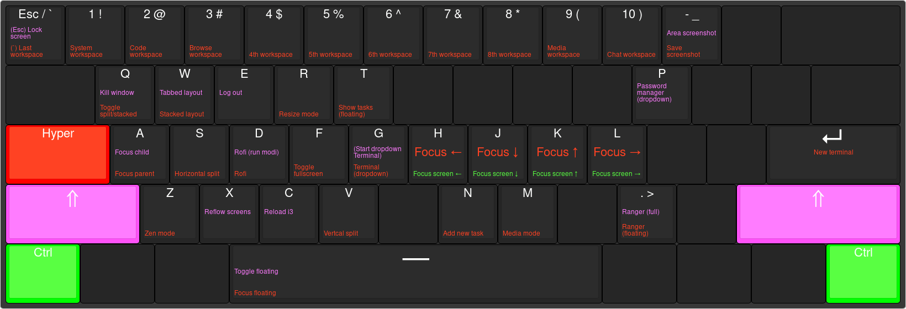

This directory will try to document my different keybindings.

## Base layout

I use an Anne Pro 60% keyboard that looks like this (with my custom layout set):

## Hyper keybinds

When pressing Hyper, the following shortcuts become available.

| Color   | Modifiers                                         |
|---------|---------------------------------------------------|
| Red     | <kbd>Hyper</kbd>                                  |
| Magenta | <kbd>Hyper</kbd> <kbd>Shift</kbd>                 |
| Green   | <kbd>Hyper</kbd> <kbd>Ctrl</kbd>                  |
| Teal    | <kbd>Hyper</kbd> <kbd>Ctrl</kbd> <kbd>Shift</kbd> |
