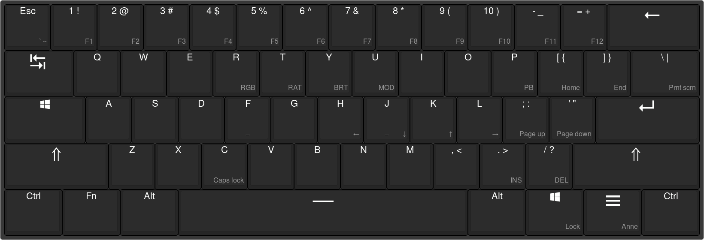
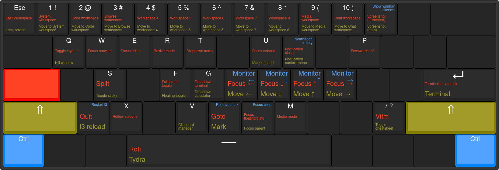

This directory will try to document my different keybindings.

## Base layout

I use an Anne Pro 60% keyboard that looks like this (with my custom layout set):

## Super keybinds

When holding Super ("Windows key", "Logo key", etc.), the following shortcuts
become available:

| Color   | Modifiers                                         |
|---------|---------------------------------------------------|
| Red     | <kbd>Super</kbd>                                  |
| Yellow  | <kbd>Super</kbd> <kbd>Shift</kbd>                 |
| Blue    | <kbd>Super</kbd> <kbd>Ctrl</kbd>                  |

This cheatsheet can be shown on the current screen with
<kbd>Super</kbd> <kbd>?</kbd>.
